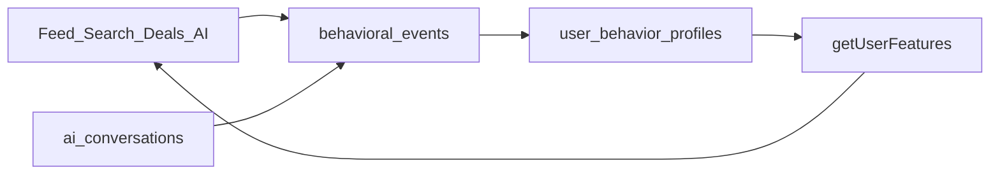

# Perfil evolutivo + progressive profiling

## Producto (P0 — live)

1. **Primera sesión Google:** sin modales de DNI / WhatsApp / demografía.
2. **Sesiones siguientes:** un solo prompt por visita (browser session), omitible con **X**.
3. Al completar un dato → no se vuelve a pedir.
4. Al omitir (X) → cooldown 48h para ese prompt.
5. **Gates duros intactos:** publicar / negocio / rider → identidad + KYC.

### Cola de prompts

| Orden | ID | Campo |
|-------|-----|--------|
| 1 | `whatsapp` | número (+ OTP opcional) |
| 2 | `demographics` | fecha_nacimiento / género |
| 3 | `dni_soft` | DNI padrón |
| 4 | `intents` | intencion + capabilities |

### Archivos P0

- `lib/profiling/*`, `components/profiling/ProgressivePromptModal.tsx`
- APIs `/api/profiling/prompts/{next,dismiss,complete}`
- Migración `045_user_profile_prompts`

---

## P1 — Señales unificadas (implementado)

| Pieza | Dónde |
|-------|--------|
| Merge anonymous→user en login | `lib/behavior/merge-anonymous.ts`, `POST /api/events/merge`, hook en `AuthContext` SIGNED_IN |
| Rebuild incremental alto-señal | `POST /api/events` tras favorite/contact/dismiss/deal high-signal |
| `getUserFeatures` | `lib/behavior/features.ts` — deals feed + search + AI |
| Deal events fix | `lib/deals/analytics.ts` usa `payload`/`context` |
| Índice merge | migración `046_personalization_p1.sql` |

## P2 — Memoria AI + search (implementado)

| Pieza | Dónde |
|-------|--------|
| Persistencia chat | `lib/ai/conversation-persist.ts` → tabla `ai_conversations` |
| Preferencias desde chat | `recordChatInterestSignal` + evento `ai.chat.preference` |
| Search re-rank | `/api/search` carga `getUserFeatures` → `executeSearch`/`rerank` |
| Chat personalizado | `/api/ai/chat` usa `getUserFeatures` + señales |

## P3 — Evaluación + exploración (implementado)

| Pieza | Dónde |
|-------|--------|
| Funnel CTR/contact/save | `lib/behavior/funnel-metrics.ts`, vista `v_personalization_funnel_7d` |
| Admin metrics | `GET /api/admin/personalization-metrics` |
| Gate LTR | `shouldEnableLearnedRanker` (umbral 10k contactos/7d) — **no entrenar antes** |
| Exploración feed | `injectFeedExploration` en `lib/feed/ranking.ts` vía `lib/filters/apply.ts` |
| Diversidad deals | ya en `diversifyFeed` (`lib/deals/ranking.ts`) |

### Qué no hacer (sigue vigente)

- Badges infantiles; onboarding muro; CDP de pago; People API; LTR prematuro; OTP Meta obligatorio sin presupuesto.

### Ventaja competitiva

Intención de demanda local + negativos explícitos + identidad progresiva + señales de chat en el mismo feature store, sin infra paga.
